# Art to replace

Everything below is drawn in code or built from Godot primitive shapes, and each piece is a slot for real art. Screenshots were taken from the current build in the real Forward+ renderer. Priority means how much the art would improve the game's feel, not difficulty.

**Full-screen reference:**

| Exploring (third person) | Viewfinder (camera raised) |
|---|---|
| 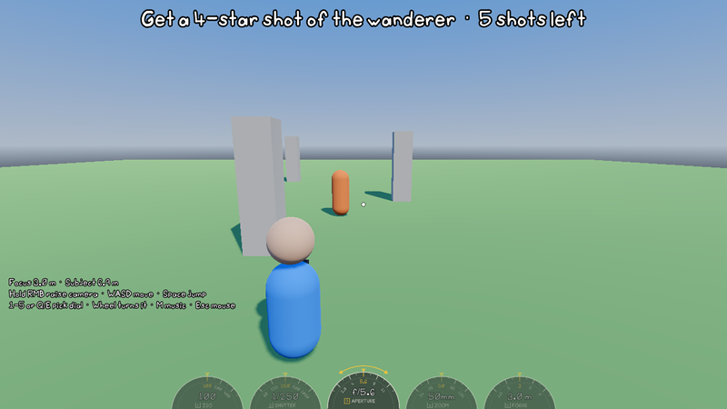 | 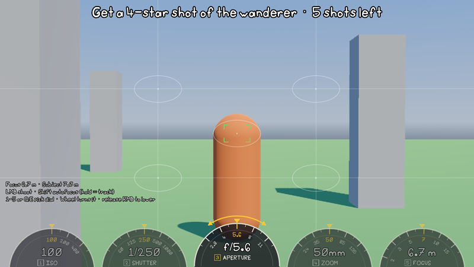 |

| Shot reveal, stars popping in | Shot reveal, done (5 stars) |
|---|---|
| 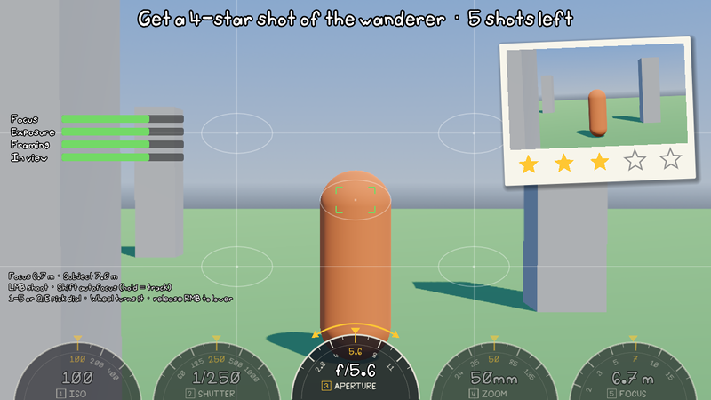 | 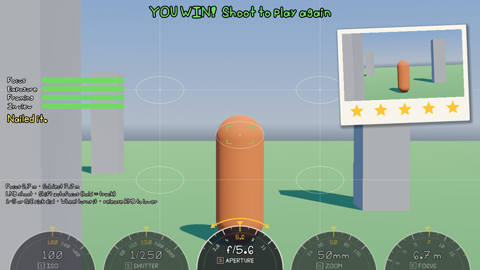 |

---

## HUD / UI

### 1. Setting dials ×5 (ISO, Shutter, Aperture, Zoom, Focus): **High**
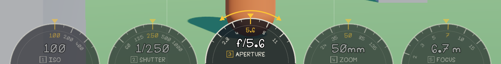
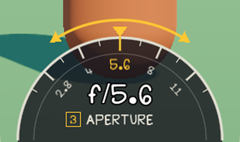
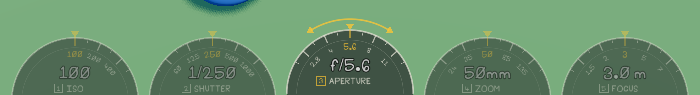

- **Code:** `scripts/ui/setting_dial.gd`. Built in `scripts/ui/photo_hud.gd` (`bind_camera`).
- **Now:** a dark half-circle with drawn tick marks, a gold triangle pointer, and a text readout. It lifts when selected and shrinks to 55% while exploring.
- **Art wanted:**
  - A dial face (a knurled metal or plastic camera dial, N64-cute).
  - A pointer/notch sprite.
  - A selected-state glow.
  - The key badge (1–5).
- **Keep in code:** the numbers and tick labels, since they change. The art goes under them, and the dial still rotates in code.

### 2. "Turn me" arrows: **Medium**
Visible above the selected dial in the close-up above.
- **Code:** `setting_dial.gd` → `_draw_turn_arrows()`.
- **Art wanted:** a curved double-headed arrow sprite, possibly with a little wobble animation.

### 3. Polaroid card and star row: **High** (the reward moment)
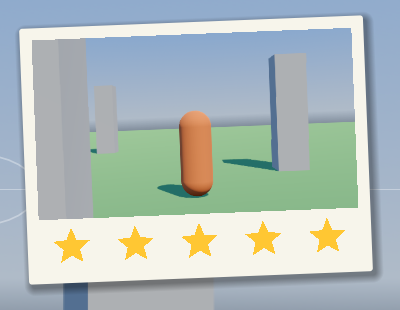
- **Code:**
  - The card style is `PolaroidStyle_1` in `scenes/sandbox/scoring_sandbox.tscn`.
  - The drop-in animation is in `photo_hud.gd` (`_drop_polaroid`).
  - The stars are drawn in `scripts/ui/star_row.gd`.
- **Now:** a flat off-white rounded rectangle with a drop shadow, and drawn 5-point stars (gold filled, grey outlined) with a scale "pop".
- **Art wanted:**
  - A polaroid paper texture (slight grain, maybe a bit of tape on top).
  - Filled and empty star sprites, plus a pop or sparkle effect.

### 4. Score bars and tip: **Medium**
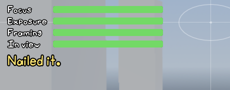
- **Code:** `photo_hud.gd` → `_build_bars()` and `_reveal_result()`. The tip is the `Result/TipLabel` node.
- **Now:** rounded `ProgressBar`s colored green, yellow or red. The weakest pillar's name turns yellow.
- **Art wanted:**
  - Bar frame and fill textures.
  - A small icon per pillar: Focus (lens), Exposure (sun), Framing (thirds grid), In view (eye).
  - Optionally, a panel behind the block.

### 5. Focus bracket (3 states): **Medium**
| Driving (racking focus) | Locked | Failed |
|---|---|---|
| 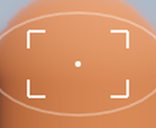 | 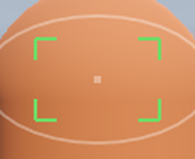 | 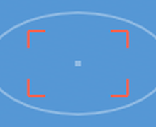 |
- **Code:** `photo_hud.gd` → `_draw_focus_bracket()`.
- **Now:** four drawn corner lines, white while driving (with a center dot), green on lock, red on fail.
- **Art wanted:** a corner-bracket sprite set (one corner sprite rotated 4×), and maybe a quick "snap" scale animation on lock.

### 6. Viewfinder overlay (thirds grid and framing zones): **Medium**
See the full viewfinder screenshot above.
- **Code:** `photo_hud.gd` → `_draw()`.
- **Now:** thin white thirds lines plus 5 white ellipses (the full-marks framing zones).
- **Art wanted:**
  - A real viewfinder frame graphic (frame lines, corner marks, maybe a slight vignette) that sells "looking through a camera".
  - Softer, prettier zone markers.

### 7. Aim dot (exploring): **Low**
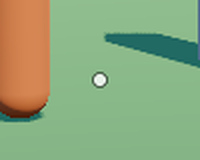
- **Code:** `photo_hud.gd` → `_draw()`.
- **Now:** a small white dot with a dark ring.
- **Art wanted:** a tiny crosshair or reticle sprite.

### 8. Shutter flash: **Medium** (fun upgrade)
No screenshot: it's a white full-screen fade lasting a quarter-second.
- **Code:** the `HUD/Overlay/Flash` ColorRect, animated in `photo_hud.gd` → `present_shot()`.
- **Art wanted:** a shutter-blade (iris) close/open animation instead of a white flash.

### 9. App icon: **High** (shows on the .exe, taskbar and window)

- **File:** `icon.svg`, set in `project.godot`.
- **Now:** a placeholder vector camera on a yellow rounded square.
- **Art wanted:** the real game icon. Also export a Windows `.ico` for the export preset's Application → Icon.

### 10. Text panels (brief, coach, controls hint, nudge): **Low**
Plain outlined text with no backing panel (see the full screenshots).
- **Code:** nodes in `scenes/sandbox/scoring_sandbox.tscn` under `HUD/Overlay`.
- **Art wanted:**
  - A panel or speech-bubble style for the coach (could be Grandma's notes).
  - A banner for the round brief.

---

## 3D placeholders (Godot primitive meshes)

### 11. Player character: **High**
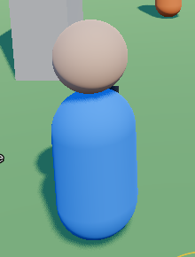
- **Where:** `Player/Body` in `scenes/sandbox/scoring_sandbox.tscn`.
- **Now:**
  - A blue capsule body (`PlayerBodyMesh_1`).
  - A skin-tone sphere head (`PlayerHeadMesh_1`).
  - Two black sphere eyes.
- **Art wanted:** the low-poly, Harvest Moon / Ness-proportioned photographer from the GDD, with walk, idle, jump and "raise camera" animations. Keep it on render layer 2 so the viewfinder doesn't see it.

### 12. Camera prop: **Medium**
A tiny dark box with a cylinder lens on the character's chest (visible in the character shot). It moves up to the face when you raise the camera.
- **Where:** `Player/Body/CameraProp` (+ `Lens`). The move is in `scripts/player/player.gd` → `_update_view()`.
- **Art wanted:**
  - A cute camera model, film and digital versions.
  - Ideally a strap, and an arm/hand pose for raising it.

### 13. The wanderer (photo subject): **High**
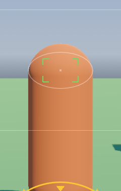
- **Where:** `Subject` in `scenes/sandbox/scoring_sandbox.tscn` (`SubjectMesh_1`, an orange capsule).
- **Art wanted:** a character or critter worth photographing, with a few "moments" (poses or animations) to catch. Keep the `Head`, `Torso` and `Feet` markers, since scoring uses them.

### 14. Sandbox environment (ground, pillars, sky): **Medium** (sandbox only)
See the exploring screenshot above.
- **Where:** `Ground`, `Props/Pillar*`, and the procedural sky in `scenes/sandbox/scoring_sandbox.tscn`.
- **Now:** a flat green 80 × 80 m box, three grey boxes, and Godot's procedural sky.
- **Art wanted:** for the prototype, a small low-poly park or city block (trees, benches, a lamp post) gives the camera more to frame. The real city comes later.
